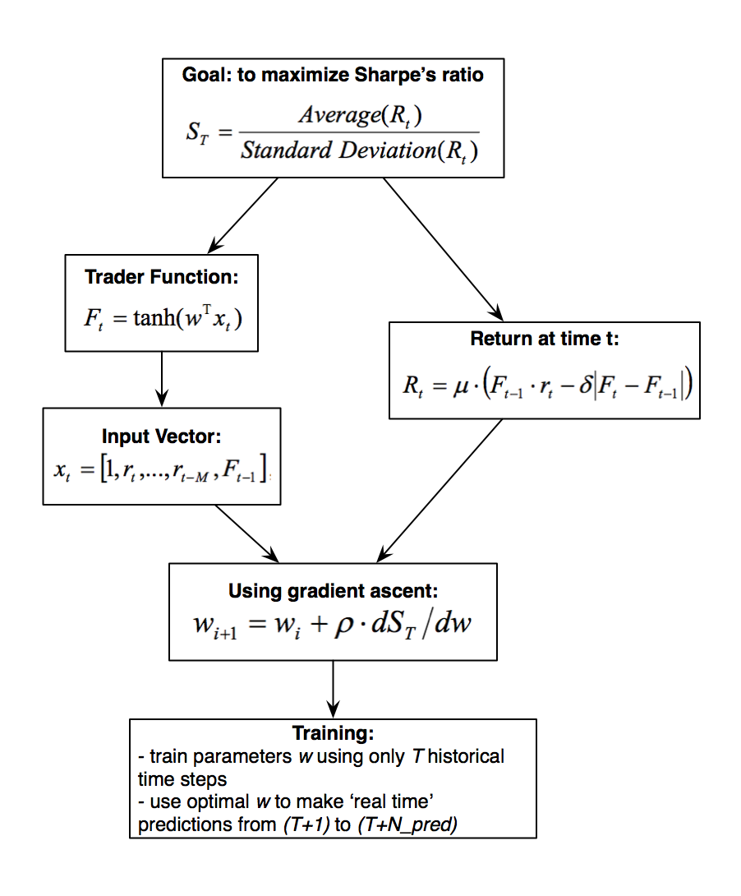

# Trader

If you want to experiment with `trader`, better you will consider [`src/main.ipynb`](src/main.ipynb).

Download stocks data with [yahoo_finance.py](https://github.com/FRTP/Framework/blob/master/src/yahoo_finance.py) to `src/data`.

Trader package: [`src/trader/tradertk.py`](src/trader/tradertk.py).

# Algorithms

Algorithms team of Frontopolar2.0
